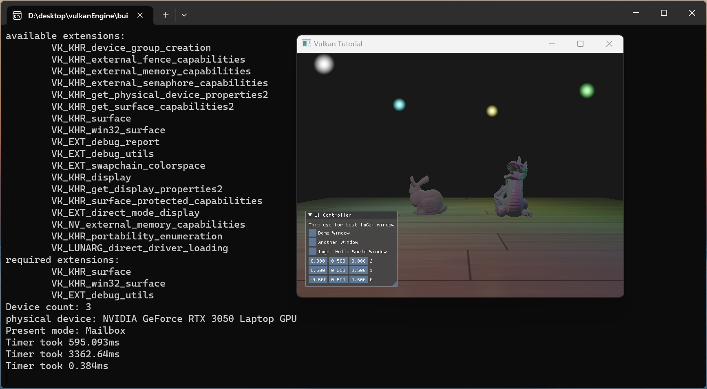

# What is it

This is the **vulkan** engine guided by https://www.youtube.com/@BrendanGalea 

You can use CMake to build but alse write a .bat for window user

you can edit .env.cmake to check whether you have the right path to the dependences.

# Dependences

Currently based on the libraries :

- [GLM](https://github.com/g-truc/glm): for the mathematic 
- [GLFW](https://www.glfw.org/): for the cross platforms window abstraction
- [ImGui](https://github.com/ocornut/imgui): for the UI interface
- [tinyobjloader](https://github.com/tinyobjloader/tinyobjloader): for the obj model loading
- [stb](https://github.com/nothings/stb): for the picture importing

# Features

point light system (forward Phong shading)

texture render system

......

# Future

**Will implement** 

- cubemap
- carton shading
- shadow map
- ECS
- drag and drop callback function to import model (multi-threads)
- pick up callback function to select scene models

...... on the way  
